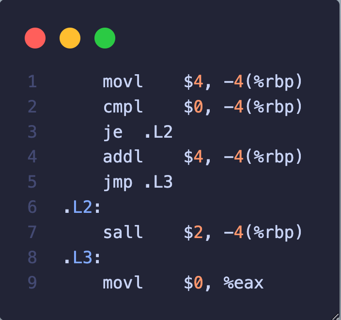

# homework1
## 1-1

执行``` gcc -DNEG -E sample.c -o sample.i ```，由于在编译的过程中定义了NEG，得到的结果为a的初始值为-4。其他与原程序相同。

## 1-2

1. cfi_def_cfa_offset 的偏移量不同，由于地址空间位数不同。

2. pushq 和 pushl不同，以及movl和movq，这两者都是同一个指令的不同形式，分别用于32位和64位的操作。

3. 寄存器名字不同，在64位的x86_64架构中，ebp 被重命名为 rbp（64位寄存器）。在64位模式下，rbp 的功能与32位模式下的 ebp 相似，用于指向当前函数的栈帧（Stack Frame）的基址。esp和rsp类似。

## 1-3

1. 使用clang进行编译时，使用-E命令处理代码，发现仅有include部分不同

2. 如图汇编代码中，clang先把变量存入寄存器eax然后操作完后再放回内存，而gcc则直接在内存中进行操作，不使用寄存器。清零操作gcc使用movl指令，而clang使用xor指令。

 

3.反汇编结果和汇编结果类似。全局符号相同，均为
```0000000000000000 T main``
